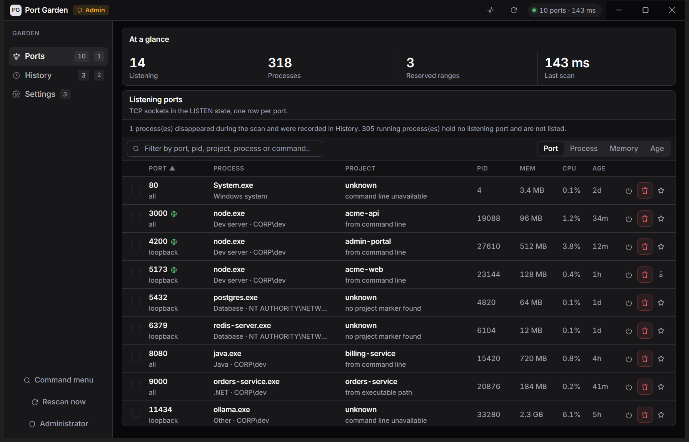

# Port Garden

[](LICENSE)
[](#windows-only)
[](../../actions/workflows/ci.yml)

A Windows desktop utility that answers one question in about a second, without a terminal: **what is holding port 3000, which project owns it, what is it actually serving, and can I stop it without taking anything else down with me.**



*Screenshot shows the interface running on sample data — see [Development](#development) to launch it that way yourself.*

Not `lsof` with a window. A port number and a pid tell you almost nothing; what you need to know is that `node.exe` on 5173 is **acme-web**, that its command line asked for 5173 and got it, that it is answering HTTP with the title *Acme Web*, that it has been up for an hour, and that three other processes share its parent. Port Garden puts that in front of you and then gets out of the way.

---

## Quick start

```sh
npm install
npm run dev
```

Requires Node 20+ and PowerShell 7 (the in-box Windows PowerShell 5.1 works too, just slower to start). Windows 10 or 11.

## What it does

- **One row per listening TCP port**, live on a three-second refresh. A dual-stack listener is one row with two bindings, not two rows.
- **Port → project**, with the evidence named. Windows does not expose another process's working directory, so the root is *inferred* from the command line or the executable path, and the row says which. It is never presented as an exact working directory.
- **Port → what it is serving.** For a dev server, one HTTP request yields the status, content type, `Server` header and page title. A green marker marks any port answering with HTML, so "which of these is a web server" is answerable by scanning the table.
- **Screenshot and open-in-browser** for anything serving HTML. The capture is a real render, not a DOM reconstruction — see [Screenshots](#screenshots).
- **Declared-port mismatch detection.** A process that asked for 4000 and is bound to 3000 is flagged. It is the most confusing failure on a busy dev machine and the most obvious once something points at it.
- **Reserved port ranges.** Search a port nothing is listening on and Port Garden explains that Windows, Hyper-V or WSL reserved that range — which is why your bind failed, and something `lsof` cannot tell you.
- **Close and Terminate, honestly.** Windows has no SIGTERM, so neither does this. See [Stopping things](#stopping-things).
- **A pre-seeded protect list** covering databases, container runtimes and virtualization services, which cannot be terminated without an explicit override in a native dialog.
- **PID-recycling protection.** Every destructive action re-verifies `(pid, creation time, image path)` in the main process before signalling.
- **History** of what stopped, and why.
- **Light and dark**, following Windows by default.
- **Optional elevation**, with a persistent badge while it is on.

### Keyboard

| | |
|---|---|
| `Ctrl+K` | command menu |
| `Ctrl+R` | rescan |
| `Ctrl+1` / `2` / `3` | Ports / History / Settings |

## Stopping things

This is the part that differs most from what people expect, so it is worth being explicit.

Windows has no SIGTERM. `process.kill(pid)` in Node calls `TerminateProcess`, which **cannot be caught** and is a forced kill. There is no "graceful, wait, then force" ladder to build.

| Action | Mechanism | Works on |
|---|---|---|
| **Close** | `taskkill /PID n` — sends `WM_CLOSE` | Windowed processes only |
| **Terminate** | `taskkill /F /T /PID n` | Everything, hard, plus children |

A console or headless dev server has no window, so **Close will be refused by the OS**. Port Garden shows you the operating system's own message and offers Terminate. It does not pretend an escalation happened.

`/T` walks the child tree at kill time, which can differ from the child count shown before the click. The confirmation dialog says so rather than implying the preview is authoritative.

## What it reads, and what it refuses to

| | |
|---|---|
| Port map | `MSFT_NetTCPConnection` where `State = 2` — the CIM class `Get-NetTCPConnection` wraps, read directly |
| Processes | `Get-Process` for every process; command line, image path and creation time only for pids holding a port |
| Parent chain | one unfiltered `Win32_Process` read |
| Reserved ranges | `netsh`, parsed positionally so it survives a non-English Windows |
| HTTP identity | one bounded `GET /` against loopback, dev-server roles only |

It makes **no outbound network requests**, stores **no credentials**, and writes only to `%APPDATA%\portgarden`. The renderer's Content-Security-Policy is `default-src 'none'`; the packaged document has no network access at all.

A few things it deliberately does not do: it does not elevate itself, it does not scan the network, it does not attribute ports to Docker or WSL containers, and it does not pretend to know a working directory it cannot read.

## Screenshots

Captured with Electron's `capturePage()` — the compositor's own output, which is what you actually see in a browser. A DOM-to-image library such as `@zumer/snapdom` was considered and deliberately not used: it reconstructs a picture from serialised DOM, which is the right tool when the goal is a capture *taller than the viewport*, but it is a reconstruction, and canvas, WebGL, cross-origin images and web fonts routinely degrade out of it. For identifying a dev server the real frame is strictly more useful and needs no injected dependency.

The hidden window that produces it is treated as hostile territory: sandboxed, no node integration, no preload, a throwaway session partition sharing no cookies with the app, loopback only, permissions denied rather than prompted, and destroyed as soon as the frame is taken.

## Performance

A scan is ~975 ms steady-state on a machine with ~1,250 processes and ~145 listeners, and the design is the sum of a dozen measurements. `npm run bench` reproduces every number.

| | |
|---|---|
| Port map via the CIM class rather than the cmdlet | 795 ms → 500 ms |
| User names for listener pids only | 293 ms → 61 ms |
| Listener rows only, instead of every process | payload ~100 KB → 22 KB |
| One long-lived PowerShell instead of a spawn per scan | 1,435 ms → **975 ms** |

`netstat -ano` was implemented and **rejected on comparison**: it is 49 ms against 515 ms, and it found 129 listeners where the CIM class found 144. Silently losing 4% of ports is the one failure that would make this tool untrustworthy, so the faster source lost.

The warm host is an accelerator and never a dependency: every failure — missing, dead, busy or timed out — falls back to a one-shot spawn, and a dead parent takes the host with it via stdin EOF. That was verified by force-killing the app, not assumed.

## Windows only

There are no macOS or Linux code paths, and adding them would mean a different probe layer, different kill semantics and a different chrome. `netstat`, `taskkill`, the WMI TCP class and the caption-overlay window are all Windows-specific, and the hard parts of this tool — that there is no SIGTERM, that process working directories are unreadable, that the port map is only complete through WMI — are Windows facts. A cross-platform Port Garden would be a new project rather than a branch in this one.

## Development

```sh
npm run verify     # typecheck + tests + production build
npm run bench      # the measurements that chose the design
npm test           # focused suites only
```

To work on the interface without a live machine, the demo page renders the **real views and the real stylesheet** against invented data:

```powershell
$env:PORTGARDEN_DEMO = '1'; npm run dev
```

It is a separate document (`src/renderer/demo.html`) and the main process refuses
it when packaged, because a port tool that could ever show fabricated rows would
have failed at the one thing it is for. That is also how the screenshot above was taken.

## Documentation

- **[AGENTS.md](AGENTS.md)** — the contributor map: architecture, every invariant, and the measurements behind the probe scripts.
- **[SECURITY.md](SECURITY.md)** — what the tool is allowed to do, the non-negotiables, and its honest limits.
- **[CONTRIBUTING.md](CONTRIBUTING.md)** — setup, ground rules, and what a bug report needs.

## Licensing

MIT — see [LICENSE](LICENSE). No runtime dependencies beyond Electron and the
bundled Inter typeface.

## Disclaimer

Independent, unofficial project. It ends processes on your machine, which is the
point and also the risk: read the confirmation dialog. Built and tested on
Windows 11 x64; the probe scripts are the part most likely to behave differently
on a machine that is not the author's, and `npm run bench` is the fastest way to
find out how.
